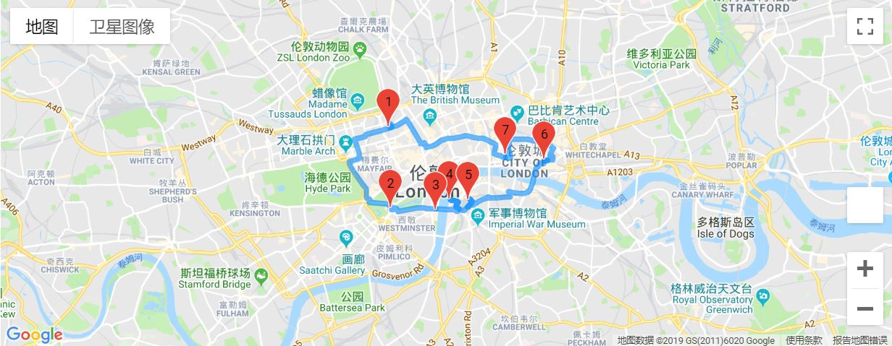

# tsp-route

[](https://opensource.org/licenses/MIT)

Spend less time to visit more places of interest. 

Open in google colab [[Click here](https://drive.google.com/file/d/1C9i1QoYKo9Rce2jowVipd8CYbsTWMKHG/view?usp=sharing)]

## Feature

* Spend less time to visit more places of interest.

* Four modes to choose including walking, driving, bicycling and transit.

* Good visualization powered by gmaps, provide two different kinds of maps.



## Introduction of Travelling salesman problem

"The **travelling salesman problem** (**TSP**) asks the following question: "Given a list of cities and the distances between each pair of cities, what is the shortest possible route that visits each city and returns to the origin city?" It is an [NP-hard](https://en.wikipedia.org/wiki/NP-hardness)problem in [combinatorial optimization](https://en.wikipedia.org/wiki/Combinatorial_optimization)." (**more details on** [**Wikipedia**](https://en.wikipedia.org/wiki/Travelling_salesman_problem))

## Usage

* Make sure you have already installed these packages: googleplaces, googlemaps, gmaps, ortools.

* Get Google API key from here: [https://developers.google.com/maps/documentation/distance-matrix/start#get-a-key](https://developers.google.com/maps/documentation/distance-matrix/start#get-a-key).

* Change the variables 'places' and 'location' then run all the cells.

* PS: If the fig is not showed after running all cells, try to restart the Jupyter notebook.

## Requirement

<details>
<summary>python-google-places 1.4.1</summary>

```
pip install python-google-places==1.4.1
```

</details>

<details>
<summary>googlemaps 3.0.2</summary>

```powershell
pip install googlemaps==3.0.2
```

</details>

<details>
<summary>gmaps 0.8.4</summary>

```powershell
pip install gmaps==0.8.4
```

</details>

<details>
<summary>OR-Tools v7.0 (2019-03)</summary>

```powershell
python -m pip install --upgrade --user ortools
```

</details>

## Chinese info

* [中文介绍](https://www.luochang.ink/posts/tsp_route/)

## License
MIT License
